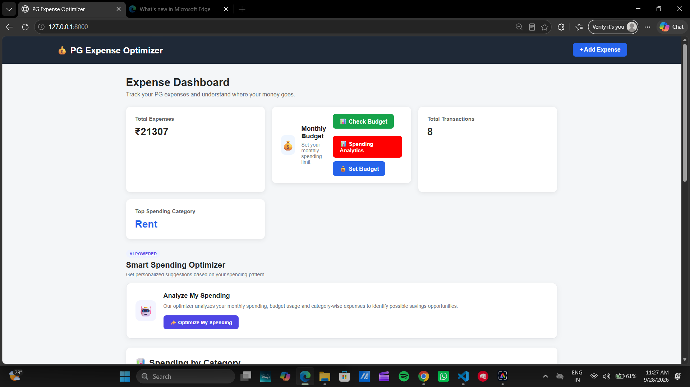
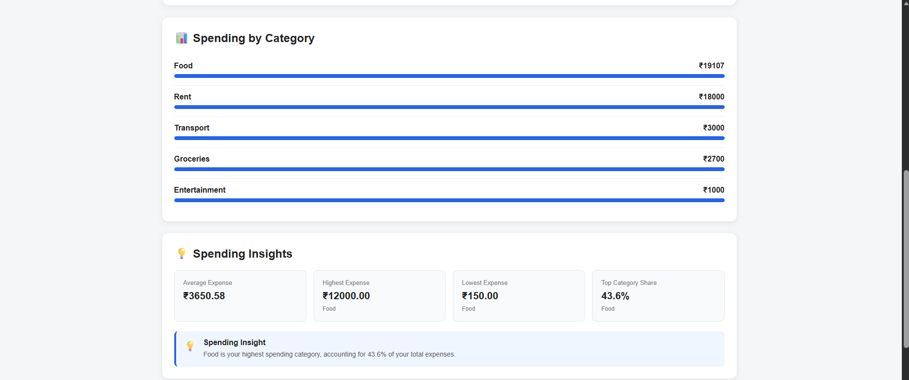
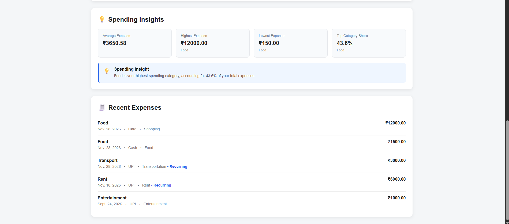
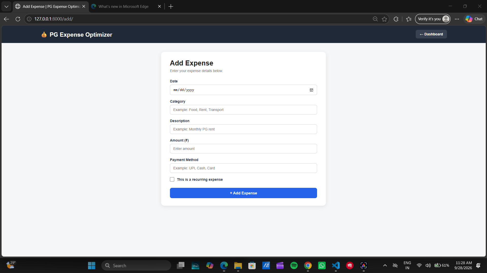
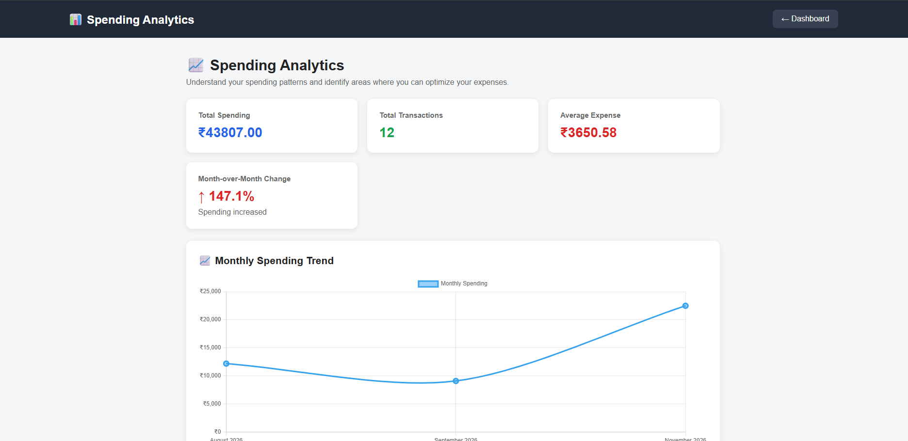
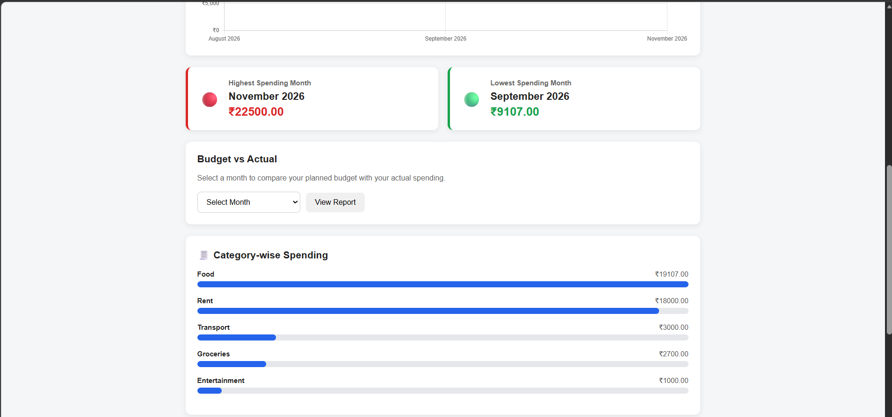
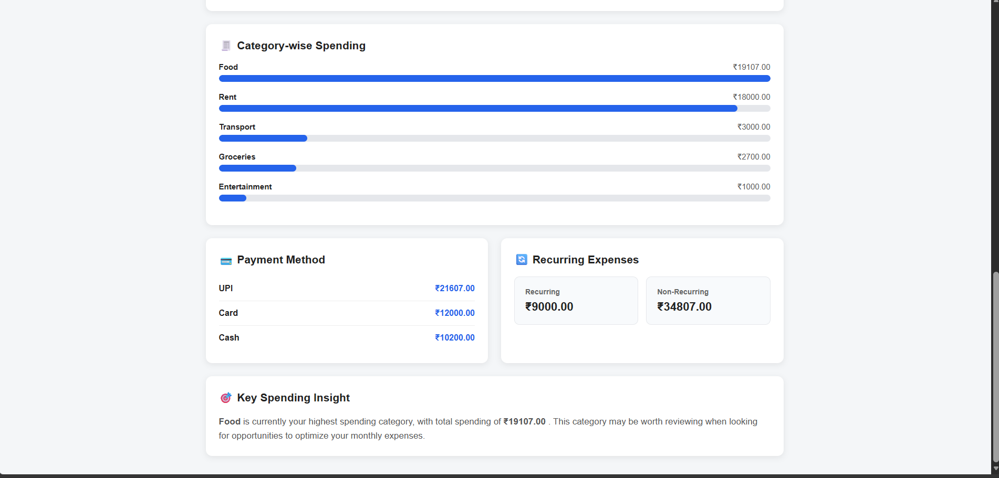
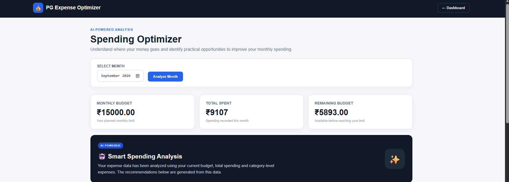
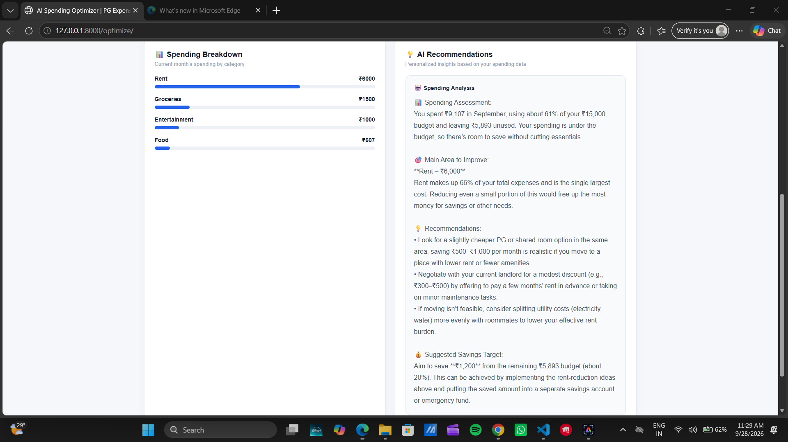

# PG Expense Optimizer

A Django-based personal expense management and cost optimization system designed to help users track expenses, manage monthly budgets, analyze spending patterns, and receive AI-powered spending recommendations.

## Features

- Expense tracking
- Category-wise expense management
- Monthly budget setting
- Budget monitoring and alerts
- Recurring expense tracking
- Spending analytics
- Monthly spending trends
- Budget vs Actual comparison
- Highest and lowest spending analysis
- AI-powered spending optimizer
- Spending insights

## Technologies Used

- Python
- Django
- SQLite
- HTML
- CSS
- JavaScript
- Chart.js
- OpenRouter API

## Project Structure

```text
pg-expense-optimizer/
│
├── expenses/
│   ├── migrations/
│   ├── templates/
│   ├── admin.py
│   ├── forms.py
│   ├── models.py
│   ├── urls.py
│   └── views.py
│
├── pg_expense_optimizer/
│   ├── settings.py
│   ├── urls.py
│   ├── asgi.py
│   └── wsgi.py
│
├── manage.py
├── .gitignore
└── README.md

## Screenshots

### Dashboard







### Add Expense



### Analytics







### AI Spending Optimizer



